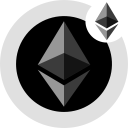
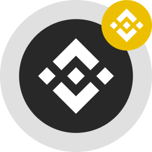

Algorand

## Vault Address 

```
XYE5SU66M6JV24REYQJMXUMIWK54X5I6TWYP25RIA3NH7YEEY6UPPWM3RY
```

## Assets

If you are using the Equito bridge for the first time, you may need to opt-in the ASA contract to view it in your wallet extension. 

| Asset Icon |Asset Name | Token |Contract Address | 
|------------|-----------|-------|-----------------|
|   | Equito Wrapped ETH | WALGO| 984540998 |
|   | Equito Wrapped ERC-20 USDC | EUSDC| 984541049 |
|   | Equito Wrapped BNB | WBNB| 984541115 |
|   | Equito Wrapped BEP-20 USDC | BUSDC | 984541210 |

## Supported Wallets

In this release the support Pera Wallet ([Pera Wallet literature](https://support.perawallet.app/en/article/create-a-new-algorand-account-on-pera-wallet-1ehbj11/)), in the next release we add support for WalletConnect ([Official site](https://walletconnect.com/)).
