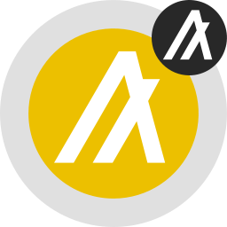
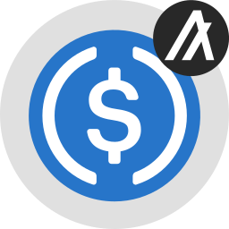
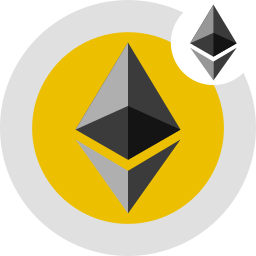
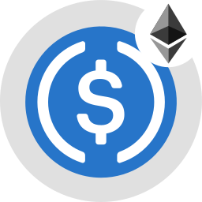

Binance

## Vault Address 

```
0x9Aa09a1D7ACD6Bb7b4bB5ae4c6F91279E78502a8
```

## Assets

If you are using the Equito bridge for the first time, you may need to 'import' the token contract address to view it in your wallet extension. 

To do so, open your wallet extension and scroll to the bottom. Depending on the wallet extension you are using, click either 'import token' or the '+' icon. Select the option for 'Custom Token' or 'Custom Asset'. 

| Asset Icon |Asset Name | Token |Contract Address | 
|------------|-----------|-------|-----------------|
|  | Equito Wrapped ALGO | WALGO| 0xa455c2d65656998844a3800E81f8294754A4a368 |
|  | Equito Wrapped ALGO USDC | AUSDC| 0x858C1E8a2117Fd494D347BD99fe32b55Ae92b4f7 |
|  | Equito Wrapped ETH | WETH| 0x76A40356655feec92E28fdcc5a64715B4161a757 |
|  | Equito Wrapped ETH USDC | EUSDC | 0xD96FBB9F12b69408457caFd55729F1F9f170d046 |

## Supported Wallets

In this release the support Binance Wallet ([Binance Wallet literature](https://binance-wallet.gitbook.io/binance-chain-wallet/bew-guides/beginers-guide/how-to-install-binance-wallet-extension)), in the next release we add support for WalletConnect ([Official site](https://walletconnect.com/)).
